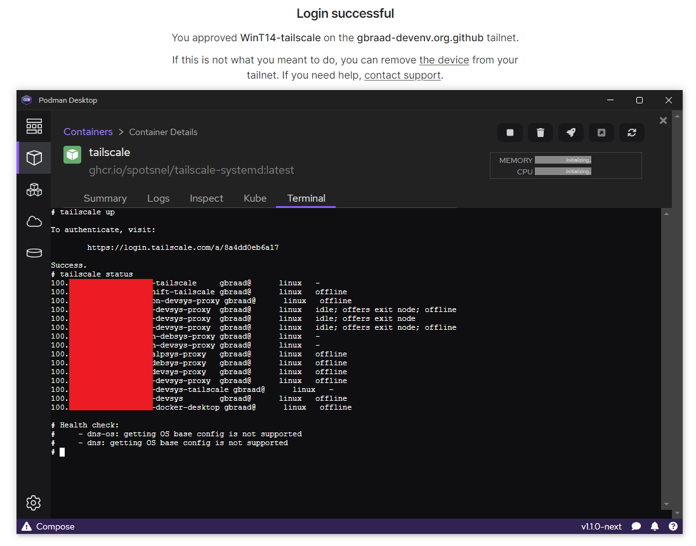

Tailscale (system container)
============================

System(d) container for use with Podman Machine, MicroShift, OpenShift Local and Podman Desktop installations, etc.




### Usage

#### Container creation
Start the system container. You can choose between the following options: [Debian](./#debian-based), [Fedora](./#fedora-based) or [RHEL UBI9](./#rhel-ubi9-based)

##### Debian-based
```
$ podman run -d --name=tailscale \
        --hostname $HOSTNAME-tailscale \
        --network=host --systemd=always \
        --cap-add=NET_ADMIN --cap-add=NET_RAW \
        ghcr.io/spotsnel/tailscale-systemd:latest
```

##### Fedora-based
```
$ podman run -d --name=tailscale \
        --hostname $HOSTNAME-tailscale \
        --network=host --systemd=always \
        --cap-add=NET_ADMIN --cap-add=NET_RAW \
        ghcr.io/spotsnel/tailscale-systemd/fedora:latest
```

##### RHEL UBI9-based
```
$ podman run -d --name=tailscale \
        --hostname $HOSTNAME-tailscale \
        --network=host --systemd=always \
        --cap-add=NET_ADMIN --cap-add=NET_RAW \
        ghcr.io/spotsnel/tailscale-systemd/ubi9:latest
```

#### Node registration
and register the node to your Tailnet
```
$ podman exec -it tailscale tailscale up

To authenticate, visit:

        https://login.tailscale.com/a/...
```

or use the Podman Desktop terminal to do so.